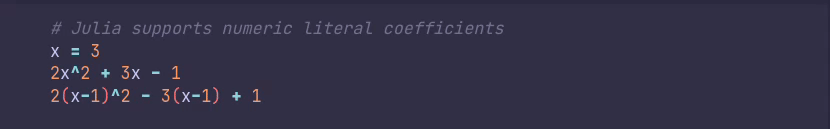

# julia-basics
Repo containing the notes I took (in the form of `.jl` scripts)
while reading through the Julia language documentation.

## Usage
The scripts may be used as a quick review, or reference,
of basic Julia language properties and syntax.

They are best used in combination with
Visual Studio Code's [official Julia language extension](https://marketplace.visualstudio.com/items?itemName=julialang.language-julia);
by pressing <kbd>Ctrl</kbd>+<kbd>Enter</kbd> on each line (or block)
and viewing the results.

Some scripts contain a Markdown string (prefixed with `md`)
which are best viewed in the terminal output window.
